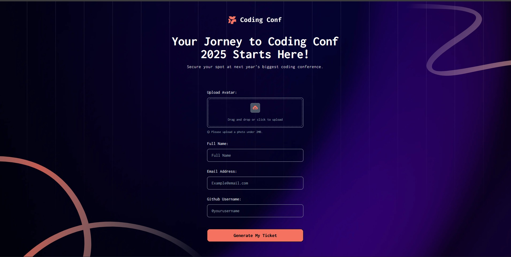
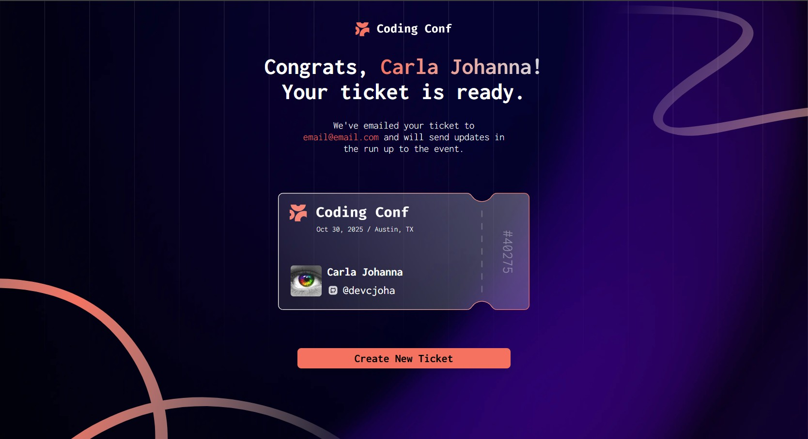
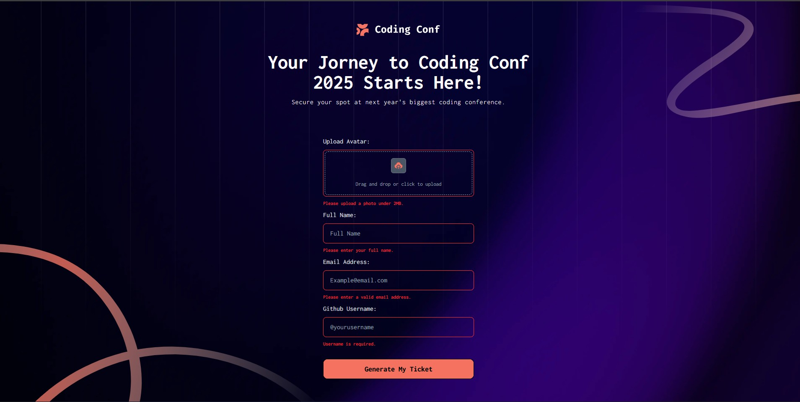
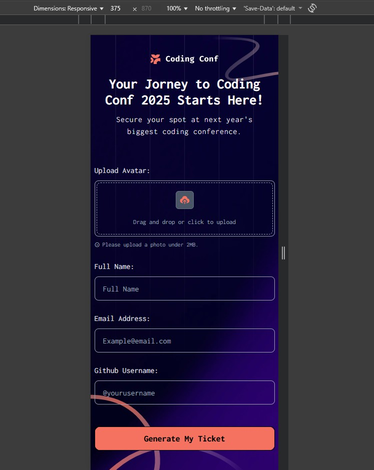
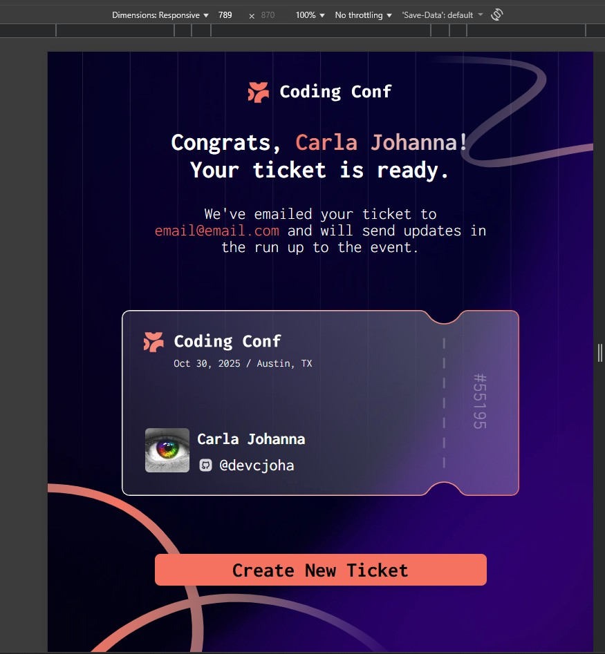

# Frontend Mentor - Conference ticket generator solution

This is a solution to the [Conference ticket generator challenge on Frontend Mentor](https://www.frontendmentor.io/challenges/conference-ticket-generator-oq5gFIU12w). Frontend Mentor challenges help you improve your coding skills by building realistic projects. 

## Table of contents

- [Frontend Mentor - Conference ticket generator solution](#frontend-mentor---conference-ticket-generator-solution)
  - [Table of contents](#table-of-contents)
  - [Overview](#overview)
    - [The challenge](#the-challenge)
    - [Screenshot](#screenshot)
    - [Live Deploys](#links)
  - [My process](#my-process)
    - [Built with](#built-with)
    - [What I learned](#what-i-learned)
    - [Continued development](#continued-development)
  - [Author](#author)

## Overview

### The challenge

Users should be able to:

- Complete the form with their details
- Receive form validation messages if:
  - Any field is missed
  - The email address is not formatted correctly
  - The avatar upload is too big or the wrong image format
- Complete the form only using their keyboard
- Have inputs, form field hints, and error messages announced on their screen reader
- See the generated conference ticket when they successfully submit the form
- View the optimal layout for the interface depending on their device's screen size
- See hover and focus states for all interactive elements on the page


### Screenshot

<p align="center">
  
  &nbsp;&nbsp;&nbsp;&nbsp;&nbsp;&nbsp;
  
  &nbsp;&nbsp;&nbsp;&nbsp;&nbsp;&nbsp;
  
  &nbsp;&nbsp;&nbsp;&nbsp;&nbsp;&nbsp;
  
  &nbsp;&nbsp;&nbsp;&nbsp;&nbsp;&nbsp;
  
  &nbsp;&nbsp;&nbsp;&nbsp;&nbsp;&nbsp;
  
</p>

## Author

- Website - [Carla Johanna](https://github.com/devcjoha)
- Frontend Mentor - [@devcjoha](https://www.frontendmentor.io/profile/devcjoha)
- X - [@CarlitaJohanna](https://www.x.com/carlitajohana)


## 🚀 Live Deploys

[](https://devcjoha.github.io/reactjs-conference-ticket-generator/)
[](https://reactjs-conference-ticket-generator.vercel.app/)

- Solution URL: [code](https://github.com/devcjoha/reactjs-conference-ticket-generator)
- Live Site URL: [Deploy Vercel](https://reactjs-conference-ticket-generator.vercel.app/)
- Live Site URL: [Deploy-Github-Pages](https://devcjoha.github.io/reactjs-conference-ticket-generator/)


## My process

### Built with

<p align="center">

 &nbsp;&nbsp;&nbsp;&nbsp;&nbsp;&nbsp;

 &nbsp;&nbsp;&nbsp;&nbsp;&nbsp;&nbsp;

 &nbsp;&nbsp;&nbsp;&nbsp;&nbsp;&nbsp;

 &nbsp;&nbsp;&nbsp;&nbsp;&nbsp;&nbsp;

 &nbsp;&nbsp;&nbsp;&nbsp;&nbsp;&nbsp;

</p>

- React (component-based architecture).

- Vite (development and packaging).

- Functional components and hooks (useState).

- Tailwind custom properties.

- Responsive design.

- Error validation for each input, as needed.

- Image loading.

- Ticket displaying the browser date.


### 👩🏻‍🦱 What I learned

Durante este proyecto reforcé el uso de formularios accesibles en React, incluyendo validaciones personalizadas y manejo de errores visuales y auditivos. Aprendí a trabajar con react-images-uploading para gestionar avatares, y a configurar rutas con React Router en entornos estáticos como GitHub Pages. También profundicé en la configuración de Vite para despliegues múltiples (Vercel y GitHub Pages).

### 💥 Continued development

During this project, I strengthened my use of accessible forms in React, including custom validations and handling visual and auditory errors. I learned to work with `react-images-uploading` to manage avatars and to configure routes with React Router in static environments like GitHub Pages. I also delved deeper into configuring Vite for multiple deployments (Vercel and GitHub Pages).


## 🚀 Deployment & Environment Setup

This project is configured to work correctly in both local development and production (GitHub Pages).

### 🧪 Entornos

- **Local**: Use `/` as the base for routes.

- **Production (GitHub Pages)**: Use `/reactjs-conference-ticket-generator/` as the base.

### ⚙️ Scripts disponibles

```bash
# Ejecuta el proyecto en desarrollo local
npm run dev

# Build estándar (no recomendado para GitHub Pages)
npm run build

# Build para GitHub Pages (usa base name correcto)
npm run build:gh

# Vista previa del build
npm run preview
```
### 📦 Variables de entorno

- **The basename** is dynamically configured using the ```GITHUB_PAGES``` variable.

- **In local development:** you don't need to define anything.

- **In production:** the ```build:gh``` script automatically defines ```GITHUB_PAGES=true```.

### 🧠 Why this configuration?

React Router requires the basename to match the site's base URL. This logic prevents errors such as:

```js 
<Router basename="/reactjs-conference-ticket-generator"> is not able to match the URL "/"
```
Thanks to this configuration, you don't need to modify your code every time you change environments.

### 🧩 Environment Configuration
This project uses environment variables to manage paths and dynamic deployments. To maintain security and avoid conflicts, the actual .env files are excluded from the repository using .gitignore.

📄 Example File
An .env.example file is included as a template:

```env
# .env.example
VITE_BASE_URL=/
GITHUB_PAGES=false
```
🛠️ How to Use It?


Copy the example file:

```bash
cp .env.example .env

```
Adjust the values ​​according to your environment:
```env
VITE_BASE_URL=/
GITHUB_PAGES=false
For production (GitHub Pages):
```
```env
VITE_BASE_URL=/reactjs-conference-ticket-generator/
GITHUB_PAGES=true
```
Use the scripts defined in package.json:
```bash
npm run dev        # desarrollo local
npm run build:gh   # build para GitHub Pages
```

## Author

- Website - [Carla Johanna](https://github.com/devcjoha)
- Frontend Mentor - [@devcjoha](https://www.frontendmentor.io/profile/devcjoha)
- X - [@CarlitaJohanna](https://www.x.com/carlitajohana)